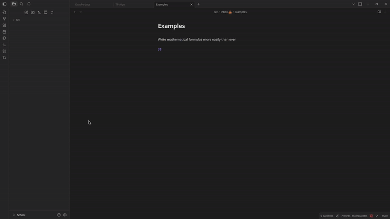

# LaTeX Auto-Completion Plugin

This plugin will a very simple of way autocompletion feature for your LaTeX commands.

To use it juste type "\\" follow by your command and you will see suggestions

## Features

- Provides LaTeX auto-completion.

> Do you have a nice feature to suggest? Please open a GitHub issue.

## Features in Progress

- Adds shortcuts like "\a/b" -> \frac{a}{b}.
